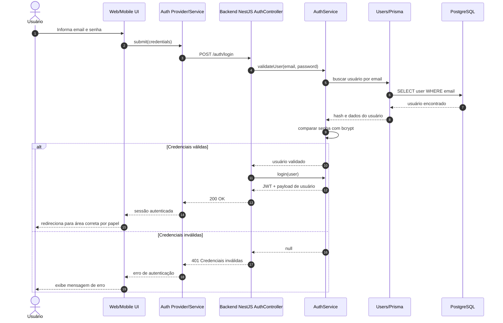
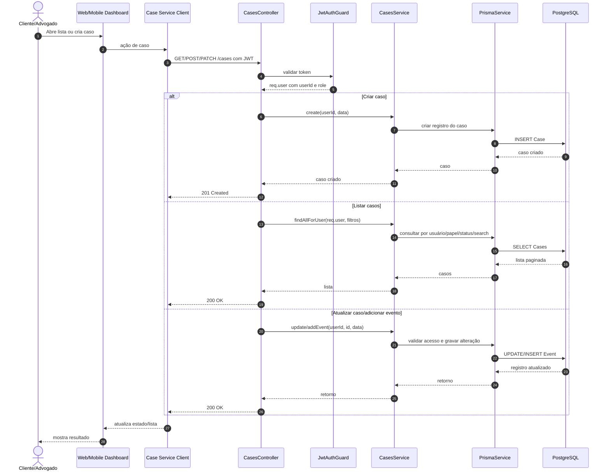
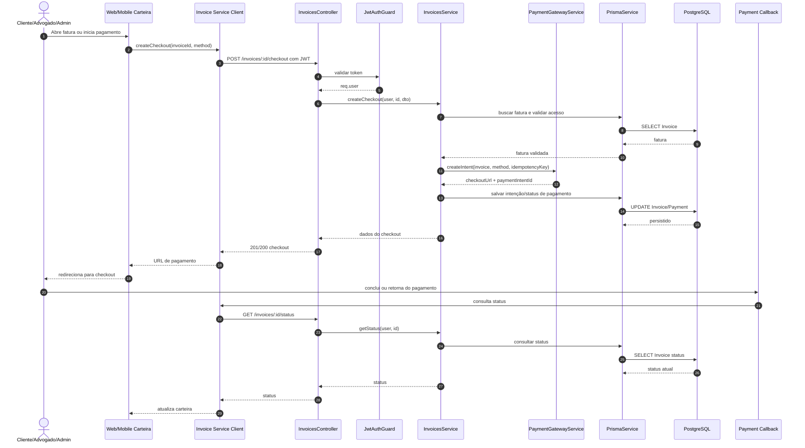

# Arquitetura — LegalCareApp

Versão: 1.0 | Atualizado em: 2026-05-09

## Visão geral

O LegalCareApp é uma plataforma jurídica digital organizada como monorepo, com aplicações web, mobile, backend, design system e módulos auxiliares de integração. A solução atende clientes, advogados e administradores, oferecendo autenticação, gestão de casos, chat, documentos, agenda, notificações, financeiro e pagamentos. O backend centraliza regras de negócio em NestJS, persiste dados via Prisma/PostgreSQL e expõe APIs protegidas por JWT. As interfaces web e mobile consomem essas APIs e compartilham conceitos visuais por meio de um design system local.

## Diagrama de arquitetura

```mermaid
flowchart TB
  subgraph Clients["Canais de acesso"]
    Web["Web App\nNext.js 15 / React"]
    Mobile["Mobile App\nExpo / React Native"]
    Admin["Admin Web\nNext.js"]
  end

  subgraph Frontend["Camada frontend"]
    PublicRoutes["Rotas públicas\nlogin, cadastro, planos, busca"]
    DashboardRoutes["Dashboard cliente/advogado\ncasos, chat, financeiro, perfil"]
    AdminRoutes["Rotas admin\nusuários, dashboard, financeiro, settings"]
    DesignSystem["@legalcare/design-system\ncomponentes e tokens"]
  end

  subgraph Backend["Backend API — NestJS"]
    AppModule["AppModule"]
    Auth["AuthModule\nJWT, login, cadastro"]
    Users["UsersModule\nusuários"]
    Profile["ProfileModule\nperfil e avatar"]
    Cases["CasesModule\ncasos e eventos"]
    Documents["DocumentsModule\ndocumentos e uploads"]
    Chat["ChatModule\nREST + Socket.IO"]
    Scheduling["SchedulingModule\nagendamentos"]
    Finance["FinanceModule\nvisão financeira"]
    Invoices["InvoicesModule\nfaturas e checkout"]
    Plans["PlansModule\nplanos"]
    Lawyers["LawyersModule\nadvogados"]
    Notifications["NotificationsModule\nnotificações e scheduler"]
    AdminModuleNode["AdminModule\noperações administrativas"]
    PrismaModule["PrismaModule"]
    ExceptionFilter["HttpExceptionFilter"]
    ValidationPipe["ValidationPipe\nwhitelist + transform"]
  end

  subgraph Persistence["Persistência e arquivos"]
    Prisma["Prisma Client"]
    Postgres[("PostgreSQL")]
    Uploads["/uploads\narquivos estáticos"]
  end

  subgraph External["Serviços externos / adaptadores"]
    PaymentGateway["PaymentGatewayService\ncheckout simulado/adaptável"]
    S3["AWS S3 SDK\narmazenamento de documentos/avatar"]
    Push["Expo Notifications\npush mobile"]
  end

  Web --> PublicRoutes
  Web --> DashboardRoutes
  Admin --> AdminRoutes
  Mobile --> PublicRoutes
  Mobile --> DashboardRoutes

  PublicRoutes --> DesignSystem
  DashboardRoutes --> DesignSystem
  AdminRoutes --> DesignSystem

  PublicRoutes --> Auth
  DashboardRoutes --> Cases
  DashboardRoutes --> Documents
  DashboardRoutes --> Chat
  DashboardRoutes --> Scheduling
  DashboardRoutes --> Invoices
  DashboardRoutes --> Profile
  AdminRoutes --> AdminModuleNode
  AdminRoutes --> Finance
  AdminRoutes --> Users

  AppModule --> Auth
  AppModule --> Users
  AppModule --> Profile
  AppModule --> Cases
  AppModule --> Documents
  AppModule --> Chat
  AppModule --> Scheduling
  AppModule --> Finance
  AppModule --> Invoices
  AppModule --> Plans
  AppModule --> Lawyers
  AppModule --> Notifications
  AppModule --> AdminModuleNode
  AppModule --> PrismaModule
  AppModule --> ExceptionFilter
  AppModule --> ValidationPipe

  Auth --> PrismaModule
  Users --> PrismaModule
  Profile --> PrismaModule
  Cases --> PrismaModule
  Documents --> PrismaModule
  Chat --> PrismaModule
  Scheduling --> PrismaModule
  Finance --> PrismaModule
  Invoices --> PrismaModule
  Plans --> PrismaModule
  Lawyers --> PrismaModule
  Notifications --> PrismaModule
  AdminModuleNode --> PrismaModule

  PrismaModule --> Prisma
  Prisma --> Postgres
  Documents --> Uploads
  Profile --> Uploads
  Documents --> S3
  Profile --> S3
  Invoices --> PaymentGateway
  Notifications --> Push
```

## Mapa de dependências

### Dependências por pacote do monorepo

| Pacote | Responsabilidade | Principais tecnologias | Depende de | Consumido por |
|---|---|---|---|---|
| `package.json` raiz | Orquestra scripts do monorepo | npm workspaces por prefixo, Node 22 | `backend`, `web`, `mobile`, `design-system` | Desenvolvedores, CI |
| `backend` | API, regras de negócio, autenticação, persistência e integrações | NestJS, Prisma, JWT, Socket.IO, AWS SDK, PDFKit | PostgreSQL, variáveis de ambiente, uploads locais, adaptadores externos | Web, Mobile, Admin, integrações |
| `web` | Aplicação web e painel admin | Next.js 15, React, NextAuth, Playwright, Recharts | Backend API, `@legalcare/design-system` | Usuários web, administradores |
| `mobile` | Aplicativo mobile multiplataforma | Expo, React Native, Expo Router, React Query, Socket.IO Client | Backend API, notificações Expo, armazenamento seguro | Clientes e advogados no mobile |
| `design-system` | Componentes compartilhados e tokens visuais | React, TypeScript, Tailwind, PostCSS | Tokens próprios | Web e futuras superfícies React |
| `integrations` | Scripts/adaptadores auxiliares | Node.js ESM | APIs internas/externas | Operações e automações |
| `docs` | Documentação funcional e técnica | Markdown/HTML | Código e decisões do produto | Time de produto, engenharia e QA |
| `infra` | Referências de infraestrutura | Markdown, Docker Compose no root | Banco/serviços locais | Engenharia/DevOps |

### Dependências backend por módulo

| Módulo NestJS | Responsabilidade | Dependências internas | Dependências externas | Observações |
|---|---|---|---|---|
| `AppModule` | Composição da aplicação | Todos os módulos de domínio | NestJS core | Raiz da API |
| `AuthModule` | Cadastro, login, JWT e recuperação de senha | `UsersModule`, `PrismaModule`, guards JWT | `bcrypt`, `@nestjs/jwt`, `passport-jwt` | Protege rotas autenticadas |
| `UsersModule` | Cadastro e consulta de usuários | `PrismaModule` | Prisma Client | Base para papéis cliente/advogado/admin |
| `ProfileModule` | Dados de perfil, senha, avatar e perfil do advogado | `PrismaModule` | `multer`, AWS SDK quando aplicável | Usa upload/armazenamento de avatar |
| `CasesModule` | Criação, listagem, atualização, eventos e remoção de casos | `PrismaModule`, `JwtAuthGuard` | Prisma Client | Filtra por usuário/papel |
| `DocumentsModule` | Upload, metadados e acesso a documentos | `PrismaModule` | `multer`, AWS SDK | Relacionado a casos/documentos |
| `ChatModule` | Conversas, mensagens e tempo real | `PrismaModule` | `@nestjs/websockets`, Socket.IO | Exposto por REST e gateway |
| `SchedulingModule` | Agenda e compromissos | `PrismaModule` | Prisma Client | Relacionado a casos e usuários |
| `FinanceModule` | Métricas e visão financeira | `PrismaModule` | Prisma Client | Usado por dashboards/admin |
| `InvoicesModule` | Faturas, resumo, status e checkout | `PrismaModule`, `PaymentGatewayService` | Prisma Client | Checkout usa adaptador de gateway |
| `PlansModule` | Planos comerciais | `PrismaModule` | Prisma Client | Exposto para contratação/consulta |
| `LawyersModule` | Busca e dados públicos de advogados | `PrismaModule` | Prisma Client | Consumido por busca/perfis públicos |
| `NotificationsModule` | Notificações e rotinas agendadas | `PrismaModule` | scheduler, Expo Notifications quando aplicável | Suporta alertas mobile/web |
| `AdminModule` | Operações administrativas | `UsersModule`, `FinanceModule`, `PrismaModule` | Prisma Client | Requer guarda de papel admin |
| `PrismaModule` | Acesso ao banco | `PrismaService` | PostgreSQL | Camada única de persistência |

### Dependências frontend por domínio

| Domínio frontend | Web | Mobile | Backend/API | Estado e comunicação |
|---|---|---|---|---|
| Autenticação | `/login`, `/cadastro`, `NextAuth`, provider de auth | `(auth)/login`, `(auth)/register`, `AuthContext` | `POST /auth/login`, `POST /auth/register`, `POST /auth/forgot-password` | JWT, armazenamento seguro/local |
| Dashboard | `/dashboard` e rotas de área logada | `(client)/index`, `(lawyer)/index` | módulos de casos, financeiro, notificações | React state, React Query no mobile |
| Casos | `/processos`, `/abrir-caso`, detalhes | `(client)/cases`, `(lawyer)/cases` | `GET/POST/PATCH/DELETE /cases`, `POST /cases/:id/events` | Filtros, paginação e DTOs |
| Chat | `/chat`, `/chat/[id]` | chat inbox e conversa | `ChatController`, `ChatGateway` | REST + Socket.IO |
| Financeiro/carteira | `/financeiro`, `/carteira` | wallet e detalhes de invoice | `/invoices`, `/invoices/summary`, `/invoices/:id/checkout` | polling de status e API service |
| Perfil | `/perfil`, `/configuracoes` | profile overview/edit/security | `/profile` | Upload de avatar e alteração de senha |
| Admin | `/admin/*` | Não aplicável | `AdminModule`, `UsersModule`, `FinanceModule` | Guardas de papel/rotas |
| Notificações | Componentes de badge/topbar | `NotificationsScreen`, push hooks | `NotificationsModule` | polling/push/socket conforme plataforma |

## Fluxos ponta-a-ponta

### Fluxo 1: Autenticação

| Etapa | Componente | Entrada | Saída | Regra principal |
|---|---|---|---|---|
| 1 | Web/Mobile UI | Email e senha | Requisição de login | Campos obrigatórios e formato básico |
| 2 | `AuthController` | `LoginDto` | Chamada ao serviço | Endpoint `POST /auth/login` |
| 3 | `AuthService` | Email/senha | Usuário validado ou `null` | Comparação segura com `bcrypt` |
| 4 | `PrismaService` | Email | Registro de usuário | Consulta no PostgreSQL |
| 5 | `AuthService` | Usuário validado | JWT/payload | Token assinado com `JWT_SECRET` |
| 6 | Cliente | JWT | Sessão local | Redirecionamento por papel |

**Erros previstos**

| Erro | Origem | Resposta esperada | Tratamento recomendado |
|---|---|---|---|
| Email/senha inválidos | `AuthController` / `AuthService` | `401 Unauthorized` | Exibir mensagem genérica de credenciais inválidas |
| Campo ausente ou inválido | `ValidationPipe` | `400 Bad Request` | Destacar campos obrigatórios na UI |
| Usuário inexistente | `AuthService` | `401 Unauthorized` | Não revelar se o email existe |
| `JWT_SECRET` ausente/incorreto | Configuração backend | Erro de inicialização ou assinatura | Bloquear deploy até corrigir `.env` |
| Banco indisponível | Prisma/PostgreSQL | `500` ou erro filtrado | Registrar erro e orientar tentativa posterior |

### Fluxo 2: Gestão de Casos

| Etapa | Componente | Entrada | Saída | Regra principal |
|---|---|---|---|---|
| 1 | Dashboard web/mobile | Ação do usuário | Request HTTP | Usuário precisa estar autenticado |
| 2 | `JwtAuthGuard` | Token JWT | `req.user` | Bloqueia acesso sem token válido |
| 3 | `CasesController` | Body/query/params | Chamada ao serviço | Parse de `status`, `page`, `limit` |
| 4 | `CasesService` | Usuário e dados | Operação de domínio | Filtra por usuário e papel |
| 5 | `PrismaService` | Query/mutation | Registro(s) de caso | Persistência transacional conforme operação |
| 6 | UI | Resposta da API | Estado atualizado | Recarrega lista, detalhes ou timeline |

**Erros previstos**

| Erro | Origem | Resposta esperada | Tratamento recomendado |
|---|---|---|---|
| Token ausente/expirado | `JwtAuthGuard` | `401 Unauthorized` | Redirecionar para login |
| Status inválido | `CasesController.parseStatus` | `400 Bad Request` | Exibir valores aceitos |
| Paginação inválida | `CasesController.parsePositiveInteger` | `400 Bad Request` | Normalizar page/limit na UI |
| Caso inexistente | `CasesService` | `404 Not Found` | Mostrar estado vazio ou mensagem de não encontrado |
| Acesso indevido ao caso | `CasesService` | `403 Forbidden` ou `404 Not Found` | Não expor dados de outro usuário |
| Erro de banco | Prisma/PostgreSQL | `500` filtrado | Registrar e permitir nova tentativa |

### Fluxo 3: Pagamento

| Etapa | Componente | Entrada | Saída | Regra principal |
|---|---|---|---|---|
| 1 | Carteira/financeiro | Fatura e método de pagamento | Solicitação de checkout | Usuário autenticado |
| 2 | `InvoicesController` | `CreateCheckoutDto` | Chamada ao serviço | Endpoint protegido por JWT |
| 3 | `InvoicesService` | Usuário, invoiceId e método | Fatura validada | Verifica acesso e estado da fatura |
| 4 | `PaymentGatewayService` | Fatura, método, idempotencyKey | `checkoutUrl` e `paymentIntentId` | Adaptador atual gera checkout local/simulado |
| 5 | `PrismaService` | Status/intenção | Persistência | Registra dados de pagamento |
| 6 | Callback/polling | `invoiceId` | Status atualizado | UI consulta `GET /invoices/:id/status` |

**Erros previstos**

| Erro | Origem | Resposta esperada | Tratamento recomendado |
|---|---|---|---|
| Token inválido | `JwtAuthGuard` | `401 Unauthorized` | Redirecionar para login |
| Fatura inexistente | `InvoicesService` | `404 Not Found` | Informar que a fatura não foi encontrada |
| Usuário sem acesso à fatura | `InvoicesService` | `403 Forbidden` ou `404 Not Found` | Bloquear visualização e pagamento |
| Método de pagamento inválido | DTO/Service | `400 Bad Request` | Exibir métodos aceitos |
| Gateway indisponível | `PaymentGatewayService` futuro | `502/500` | Repetir com idempotência e registrar erro |
| Status divergente | Gateway/DB | Estado inconsistente | Reconciliar status por rotina ou endpoint administrativo |

## Stack tecnológica

| Tecnologia | Versão identificada | Propósito |
|---|---:|---|
| Node.js | `>=22.0.0 <23.0.0` | Runtime padrão do monorepo |
| npm | `11.9.0` | Gerenciador de pacotes e scripts |
| NestJS | `^11.0.1` | Backend API modular |
| TypeScript | Backend `^5.7.3`, Web `^5`, Mobile `~5.9.2` | Tipagem estática nas aplicações |
| Prisma | `^6.19.3` | ORM e acesso ao PostgreSQL |
| PostgreSQL | Configurado via `DATABASE_URL` | Banco relacional principal |
| Passport JWT | `^4.0.1` | Estratégia de autenticação JWT |
| `@nestjs/jwt` | `^11.0.2` | Emissão e validação de tokens |
| bcrypt | `^6.0.0` | Hash e verificação de senhas |
| Socket.IO | Server `^4.8.3`, Client `^4.8.1` | Comunicação em tempo real para chat/notificações |
| Next.js | `15.0.3` | Aplicação web e admin |
| React Web | `19.0.0-rc-66855b96-20241106` | UI web |
| NextAuth | `^4.24.14` | Autenticação/session handling na web |
| Expo | `~54.0.33` | Aplicação mobile multiplataforma |
| React Native | `0.81.5` | UI nativa/mobile |
| Expo Router | `~6.0.23` | Roteamento mobile por arquivos |
| React Query | `^5.99.2` | Cache e sincronização de dados no mobile |
| NativeWind | `^4.2.3` | Tailwind-like styling no mobile |
| Tailwind CSS | Design `^3.4.19`, Web `4.0.0-alpha.25` | Estilização e tokens visuais |
| Recharts | `^3.8.1` | Gráficos e métricas no painel web |
| Playwright | `^1.56.1` | Testes e2e web |
| Jest | `^30.0.0` | Testes unitários/e2e backend |
| AWS SDK S3 | `^3.1037.0` | Integração com armazenamento de objetos |
| PDFKit | `^0.18.0` | Geração de documentos/PDFs |
| Docker Compose | Presente no root | Apoio a ambiente local/infra |

## Decisões de arquitetura

| Decisão | Escolha | Motivo | Alternativas descartadas |
|---|---|---|---|
| Organização do repositório | Monorepo com `backend`, `web`, `mobile`, `design-system`, `docs`, `infra` e `integrations` | Facilita evolução coordenada entre API, web, mobile e documentação | Repositórios separados para cada aplicação |
| Backend | NestJS modular | Estrutura clara por domínio, DI nativa, guards, pipes, filtros e suporte a WebSockets | Express puro, Fastify sem framework opinativo |
| Persistência | Prisma + PostgreSQL | Tipagem, migrations, produtividade e bom encaixe com domínio relacional jurídico/financeiro | SQL manual, TypeORM, banco NoSQL como primário |
| Autenticação | JWT com Passport e bcrypt | Compatível com web/mobile/API stateless e permite proteção por guards | Sessão server-side única, Basic Auth |
| Validação global | `ValidationPipe` com whitelist, transform e bloqueio de campos não permitidos | Reduz entrada inesperada e padroniza DTOs | Validação manual por controller |
| Tratamento de erros | `HttpExceptionFilter` global | Padroniza respostas de erro da API | `try/catch` espalhado em controllers |
| Frontend web | Next.js 15 | Suporte a rotas públicas, dashboard, admin e renderização híbrida | SPA Vite isolada, template server-side tradicional |
| Mobile | Expo + React Native + Expo Router | Acelera entrega iOS/Android/web com roteamento por arquivos e integração com notificações | React Native CLI puro, apps nativos separados |
| Design compartilhado | Pacote local `@legalcare/design-system` | Centraliza componentes, tokens e consistência visual | Componentes duplicados em cada app |
| Comunicação em tempo real | Socket.IO no backend e clientes | Adequado para chat e eventos em tempo real com fallback | WebSocket nativo sem abstração, polling puro |
| Pagamentos | `PaymentGatewayService` como adaptador | Isola a integração de pagamento e permite trocar gateway sem afetar controllers | Acoplar gateway diretamente ao controller/service |
| Uploads | Arquivos servidos por `/uploads` e integração S3 disponível | Suporta desenvolvimento local e caminho futuro para storage externo | Armazenar binários diretamente no banco |
| Configuração | `.env.example` no backend e variáveis via ambiente | Evita versionar segredos e documenta chaves necessárias | Hardcode de credenciais/configurações |
| Testes | Jest no backend e Playwright no web | Cobre unidade/API e fluxos críticos de UI | Testes manuais como estratégia principal |
| CI | Workflow base em `.github/workflows/ci-base.yml` | Automatiza verificações e reduz regressões | Validação apenas local |

